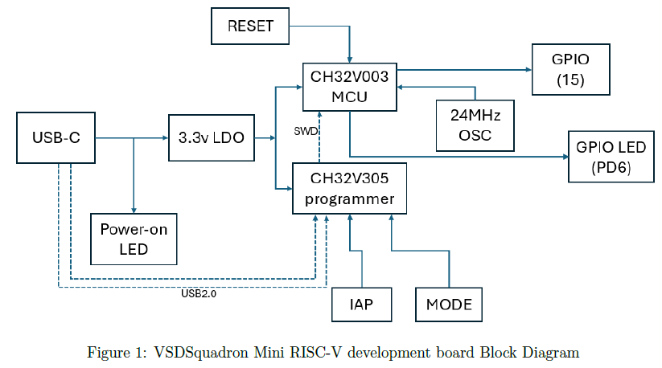
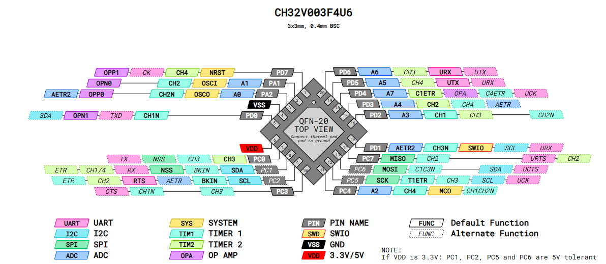
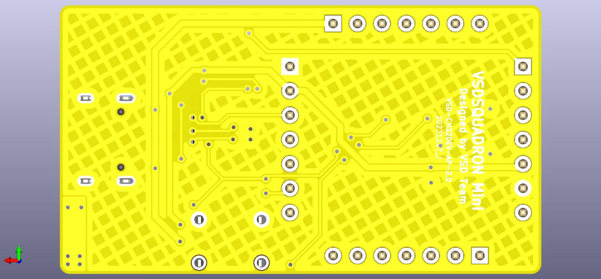
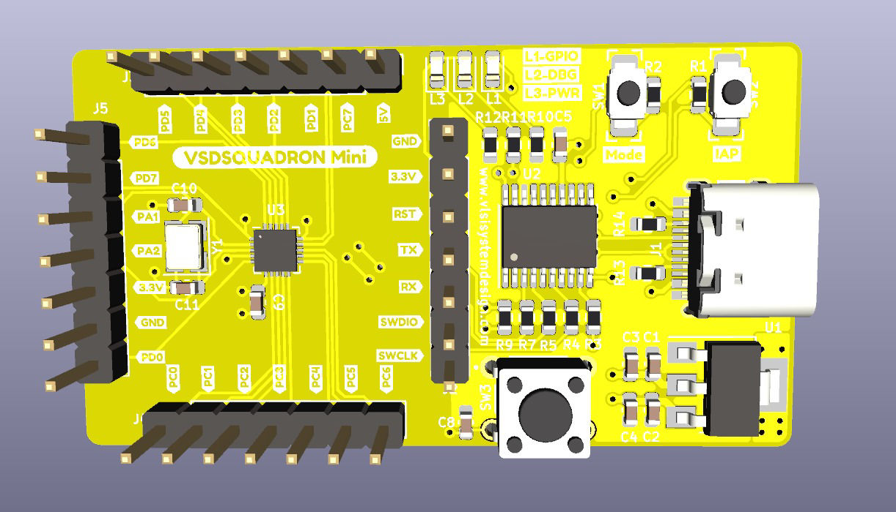
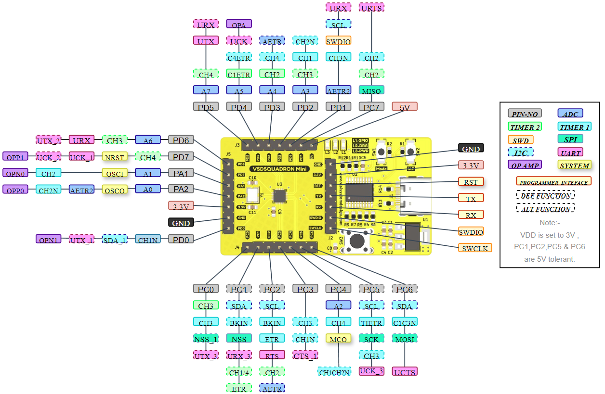
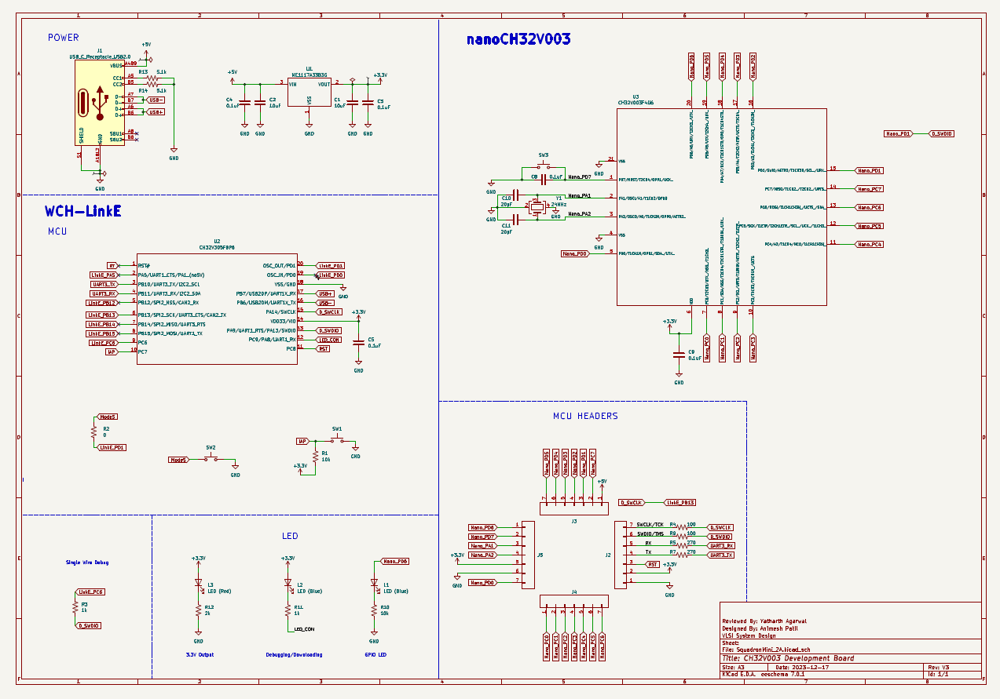

# VSDSquadron Mini RISC-V Development Board

## Features & Interfaces

| Feature | Specification |
|-------|---------------|
| **Board** | VSDSquadron Mini |
| **MCU** | CH32V003F4U6 (32-bit RISC-V, RV32EC) |
| **Core Frequency** | Up to 24 MHz |
| **Interrupts** | 2-level nested interrupts |
| **GPIO** | 15 I/O pins (3 GPIO ports) |
| **External Interrupts** | 8 lines mapped to any GPIO |
| **USART** | 1× (PD6-RX, PD5-TX) |
| **I2C** | 1× (PC1-SDA, PC2-SCL) |
| **SPI** | 1× (PC5-SCK, PC1-NSS, PC6-MOSI, PC7-MISO) |
| **PWM** | 14 channels |
| **ADC** | 10-bit (PD0–PD7, PA1, PA2, PC4) |
| **On-board LED** | 1× User LED (PD6) |
| **SRAM** | 2 KB |
| **Flash Memory** | 16 KB CodeFlash + 1920 B bootloader |
| **Clock Source** | 24 MHz internal RC, 128 kHz RC, optional external 24 MHz |
| **Programmer** | On-board CH32V305FBP6 single-wire |
| **USB Connector** | USB Type-C |
| **Input Voltage** | 5 V |
| **I/O Voltage** | 3.3 V |
| **Max I/O Current** | 8 mA source / sink per pin |
| **Debug Interface** | On-board programmer/debugger |
| **External Adapter** | Not required |

## Block Diagram

## Board Image

## Functionality reference

## pcbbottom

## pcbtop

## pinout diagram

## schematic

