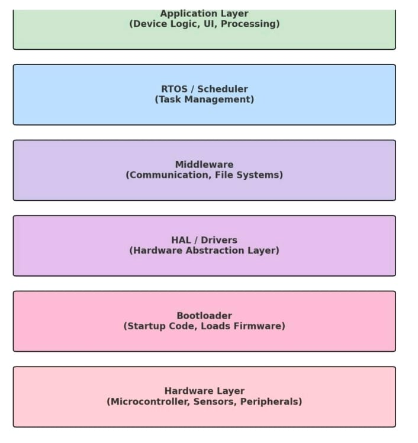
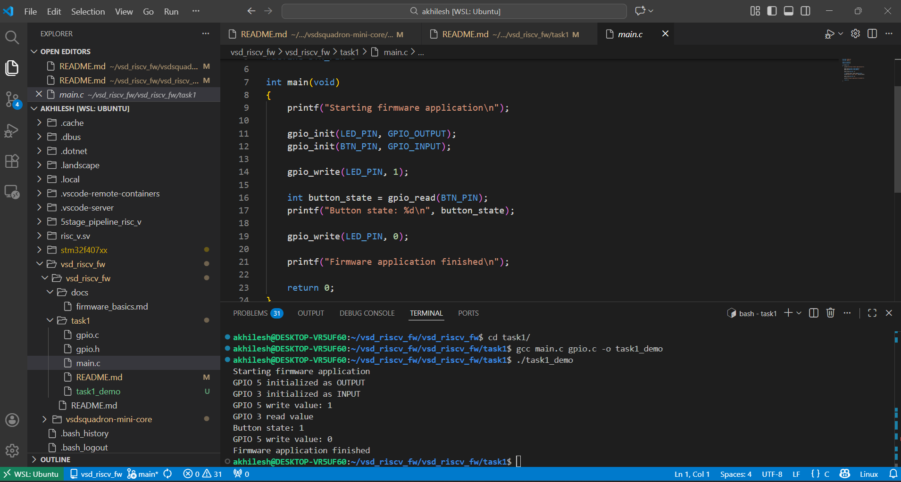
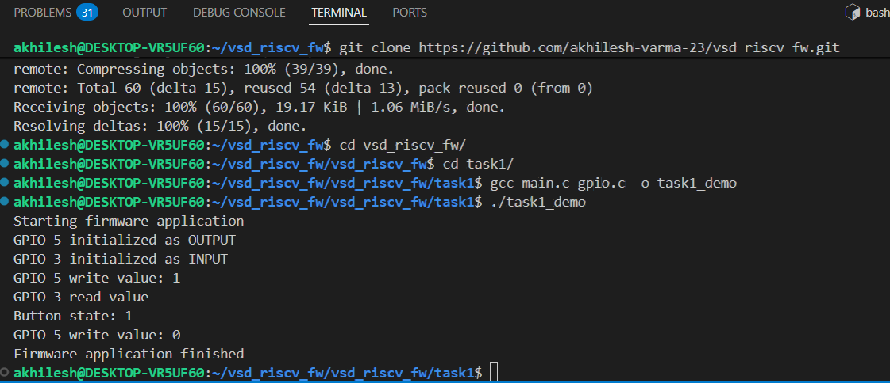

# Task 1: Firmware Library Fundamentals

## Objective

The goal of Task 1 is to:

- Understand how firmware libraries are structured
- Understand how application code uses APIs
- Set up a basic development environment
- Build and study a simple firmware-style library

This task does **not require the VSDSquadron Mini board**.

---

# What to Do

## Step 1: Read the Code

Open the following files and understand their roles:

- **gpio.h** → Contains the exposed API declarations  
- **gpio.c** → Contains the implementation of the API  
- **main.c** → Shows how the application uses the API  

This demonstrates how firmware libraries separate **interface** and **implementation**.

---

## Step 2: Build the Code

From inside the `task1` directory, run:

'''
gcc main.c gpio.c -o task1_demo
'''

---

# Task 1 Output

The following image shows the program output:

---

# Firmware Software Stack

## Hardware Layer

This is the actual physical circuitry inside the RISC-V chip — CPU, GPIO, UART, timers, memories.

For example, taking **GPIO** as reference: It contains pull-up/pull-down resistors and logic that drive a real pin HIGH or LOW when a register bit is written.

GPIO registers:

DATA register  
DIR (direction) register  

'''
0x40020000 → GPIO_DATA   // example dummy address for reference
0x40020004 → GPIO_DIR
'''

Suppose **Pin 5 controls the physical LED.**

---

## Bootloader Layer

This is the first software that runs after reset. It prepares the chip so that the main firmware can run.

**Purpose:** Bring the hardware to a usable state and load the firmware.

For GPIO it may turn on an LED or set pin directions to show that the system has powered up.

'''
*(volatile uint32_t*)0x40020004 |= (1 << 5);   // Set pin 5 as OUTPUT  
*(volatile uint32_t*)0x40020000 |= (1 << 5);   // Turn LED ON
'''

---

## HAL / Driver Layer

This layer converts hardware registers into **C functions**. It hides addresses and bit operations from higher software.

Example GPIO driver:

'''
#define GPIO_BASE 0x40020000

typedef struct {
    volatile uint32_t DATA;
    volatile uint32_t DIR;
} GPIO_Type;

#define GPIO ((GPIO_Type*)GPIO_BASE)

void gpio_set_output(int pin)
{
    GPIO->DIR |= (1 << pin);
}

void gpio_write(int pin, int value)
{
    if(value)
        GPIO->DATA |= (1 << pin);
    else
        GPIO->DATA &= ~(1 << pin);
}
'''

Instead of writing to `0x40020000`, you call:

'''
gpio_write(5,1)
'''

Now no one touches addresses directly.

**Purpose:** Make hardware easy and safe to use.

---

## Middleware Layer

This layer provides reusable system services built on drivers.

Example **GPIO LED Service**

'''
void LED_On()
{
    gpio_write(5, 1);
}

void LED_Off()
{
    gpio_write(5, 0);
}
'''

Now the application doesn’t know about GPIO pins.

---

## RTOS / Scheduler

This layer decides **which code runs and when**.  
It manages tasks, delays, priorities, and timing.

For GPIO, RTOS decides when LED blinks.

'''
void LedTask(void *p)
{
    while(1)
    {
        LED_On();
        vTaskDelay(500);
        LED_Off();
        vTaskDelay(500);
    }
}
'''

**Purpose:** Manage timing and multitasking.

---

## Application Layer

This is the **actual product logic** written by the developer.

Example:

'''
if (temperature > 80)
    LED_On();      // warning indicator
else
    LED_Off();
'''

Application never touches registers or drivers.

---

# Why are APIs important?

APIs (**Application Programming Interfaces**) act as a bridge between the application layer and the driver/firmware layer. They define a standard way for the application to request services from drivers without needing to know hardware-specific details.

Benefits:

- Separate application logic from hardware control
- Improve code readability and clarity
- Enable portability across different hardware
- Prevent unsafe or invalid hardware access
- Support reuse of drivers and application code
- Make testing and debugging easier

APIs used in **Task 1**:

'''
gpio_init
gpio_write
gpio_read
'''

---

# What You Understood From This Task

File **gpio.h** is the driver header file where all APIs and macros are declared.

File **gpio.c** is the driver source file where the APIs are implemented.  
This code interacts with the **GPIO hardware registers**.

By modifying register bits we can:

- Enable / disable GPIO
- Set or reset pin values
- Change pin mode
- Read pin values

File **main.c** is the **application code**.

In this file:

- APIs are called
- Input parameters are passed (pin number, values, mode)

The functions implemented in **gpio.c** receive these parameters and perform the required register operations.

This way the **application controls hardware through APIs instead of directly modifying registers.**

---

# Firmware Architecture Flow

'''
main.c (Application Code)
↓
gpio.h, gpio.c (Firmware Library / HAL / Driver)
↓
Peripheral Hardware Registers
↓
Microcontroller Hardware
'''

---

# Screenshots

The following image shows the **successful compilation**:

The following image shows the **program output**:

