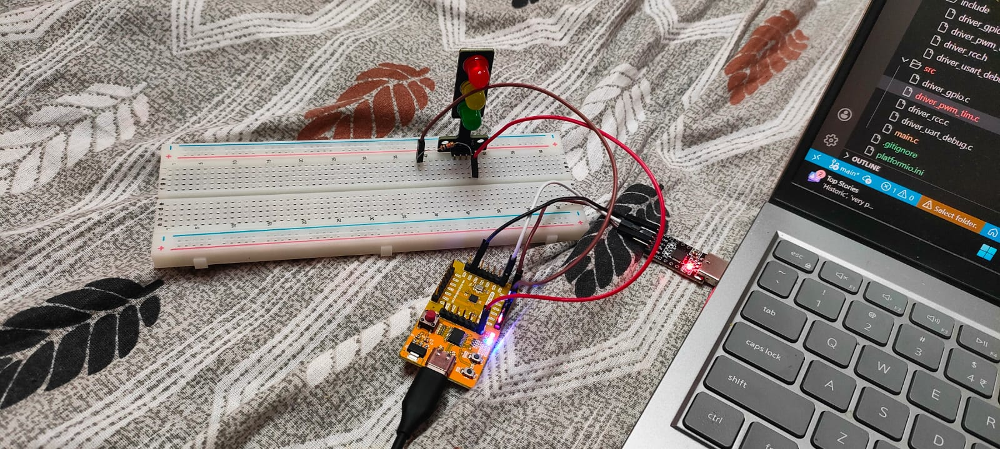

# Components Used

1. VSDSquadron Mini Development Board  
2. CP2102 USB 2.0 to TTL UART Serial Converter  
3. Breadboard  
4. Jumper Wires  
5. LED  
6. 10k Resistor  

## Connection
  - GPIO Port-D and pin-2 is used as PWM, for changing brightness of LED.

   

- For UART Prints
## UART Prints
   

## GPIO Evidence
   

## GPIO Toggle Video
   (1).mp4)