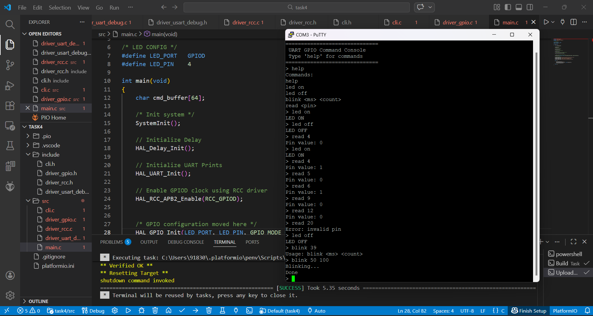
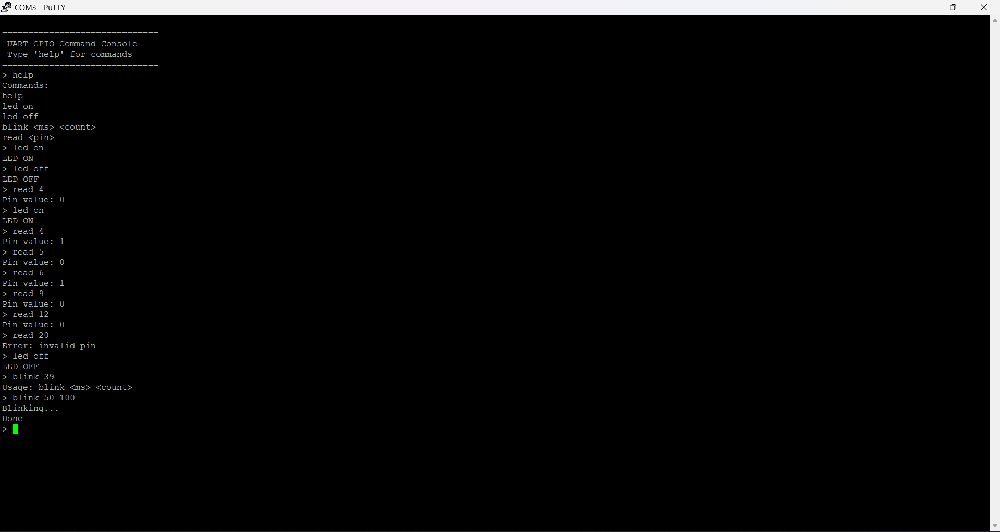
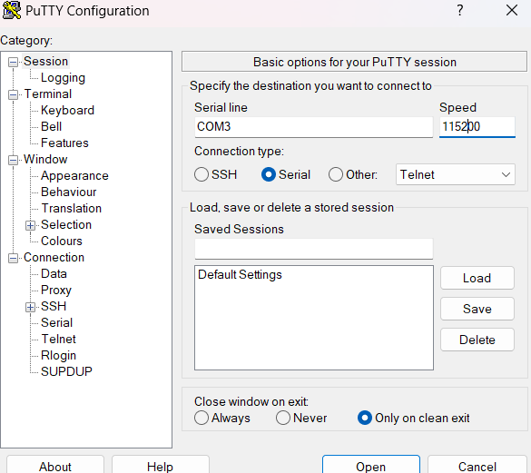
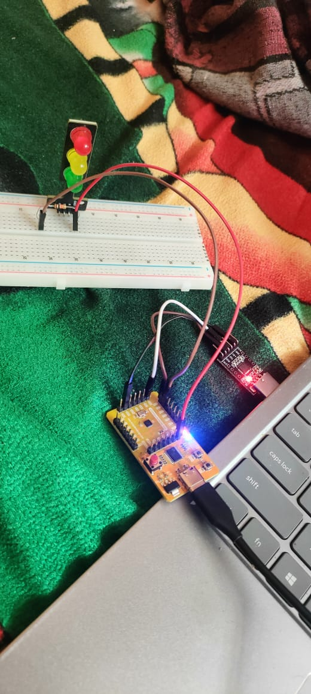

# Components Used

1. VSDSquadron Mini Development Board  
2. CP2102 USB 2.0 to TTL UART Serial Converter  
3. Breadboard  
4. Jumper Wires  
5. LED  
6. 10k Resistor  

## Connection
  - GPIO Port-D and pin-2 is used as PWM, for changing brightness of LED.

   

- For UART Prints
## UART Prints
   
   

## GPIO Evidence
   

## GPIO Evidence
   

## GPIO Toggle Video
   

# Verification Notes

## What Was Tested

- UART initialization and serial communication at **115200 baud**
- CLI command input via serial terminal (**PuTTY / VS Code Serial Monitor**)
- LED control commands

'''
led on
led off
'''

- Blink command with delay and count

'''
blink <ms> <count>
'''

- GPIO read command

'''
read <pin>
'''

- Backspace handling and command echo in terminal
- Invalid command handling and error messages

---

# What Worked

- UART TX/RX stable with **no data corruption**
- CLI correctly parses **lowercase and mixed-case inputs**
- LED toggles and responds instantly to commands
- Blink timing approximately matches entered delay
- GPIO read returns correct **HIGH/LOW values**
- Help command lists all supported commands
- Invalid inputs show proper **usage/error messages**

---

# Limitations / Known Issues

- Blink is **blocking** (no other commands accepted during blinking)
- Delay accuracy is **approximate** (busy-wait based)
- No command history or **arrow-key navigation**
- Only single GPIO port tested (**GPIOD**)
- No interrupt-based UART or **DMA support**
- Buffer size fixed (**64 bytes**) — long commands truncated