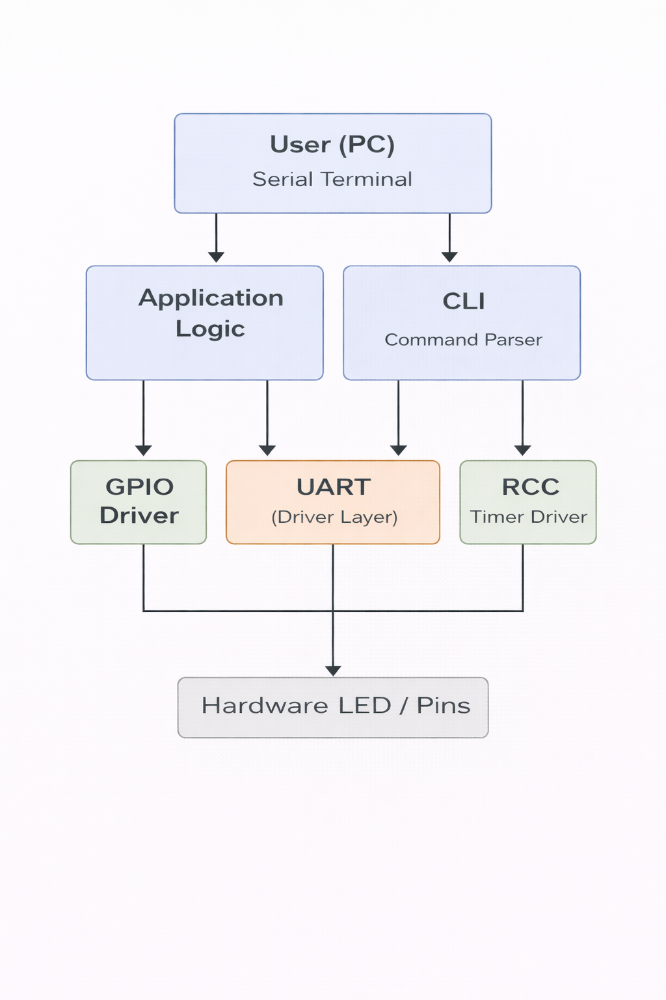

# ARCHITECTURE.md — System Design

# Overview

The system follows a **layered bare-metal architecture** where low-level hardware drivers are separated from the application logic (CLI and main loop).  
This improves **readability, maintainability, and reusability** of drivers across future projects.

---

## High-Level Block Diagram

  

   

alt text

'''
User (PC / Serial Terminal)
        ↓
CLI (Command Line Interface)
        ↓
Application Logic (main.c)
        ↓
GPIO / UART / Delay Drivers
        ↓
LED / Hardware Pins
'''

---

# System Components

## User (PC / Serial Terminal)

- User sends commands through a serial terminal (**PuTTY, TeraTerm, etc.**)
- Acts as the **input interface** to control the board

---

## CLI (Command Line Interface)

- Parses user commands

'''
blink 500 10
'''

- Validates input and decides which action to trigger
- Works as a **bridge between UART and application logic**

---

## Application Logic (main.c)

- Core program behavior and decision making
- Calls drivers based on CLI commands
- Implements features like **LED blinking and status prints**

---

## GPIO Driver

- Controls hardware pins (**LED ON/OFF, toggle**)
- Provides simple APIs instead of direct register access

---

## UART Driver Layer

- Handles serial communication between **PC and microcontroller**
- Receives commands and sends responses
- Abstracts hardware registers from upper layers

---

## Delay / Timer Driver

- Generates accurate **millisecond delays**
- Used for blinking timing and scheduling actions

---

## LED / Hardware Pins

- Final output layer
- Physical effect of commands (**LED blinking, pin state change**)

---

# Layer Separation

## 1. Driver Layer

Responsible for **direct hardware interaction**

### Drivers

- **GPIO Driver** – Configure pins, read/write/toggle
- **UART Driver** – Serial TX/RX communication
- **RCC Driver** – Clock enable/disable
- **Delay / Timer Driver** – Blocking delays

### Characteristics

- No application logic
- Reusable across multiple projects
- Hardware-specific

---

## 2. Application Layer

Contains **project-specific behavior**

### Files

- **main.c** – System initialization and infinite loop
- **cli.c** – Command parsing and action execution

### Responsibilities

- User interaction
- Command interpretation
- Calling appropriate drivers

---

## 3. Scheduler / Event System

Not used in this project.

'''
while(1)
{
    // main super-loop
}
'''

- System uses a **simple super-loop model**
- All operations are **blocking and sequential**

---

# Data Flow

'''
User Input (Terminal)
        ↓
UART RX Driver
        ↓
CLI Parser
        ↓
GPIO / Delay Drivers
        ↓
Hardware Output (LED / Pins)
'''

---

# Control Flow

'''
MCU boots → SystemInit()
        ↓
Drivers initialized (UART, GPIO, Delay)
        ↓
Startup banner printed
        ↓
Infinite loop begins
        ↓
UART waits for command
        ↓
CLI parses command
        ↓
Appropriate driver function executed
        ↓
Result printed back to UART
        ↓
Loop repeats
'''

---

# Why This Architecture Was Chosen

- **Simplicity** – Ideal for learning and small embedded systems
- **Modularity** – Drivers are independent and reusable
- **Low Overhead** – No RTOS or scheduler required
- **Clarity** – Easy debugging and step-by-step execution
- **Scalability** – Future addition of **PWM, interrupts, or RTOS** is possible without major redesign

---

This structure provides a **clean separation between hardware control and user-level logic**, which is considered **best practice in embedded firmware design**.